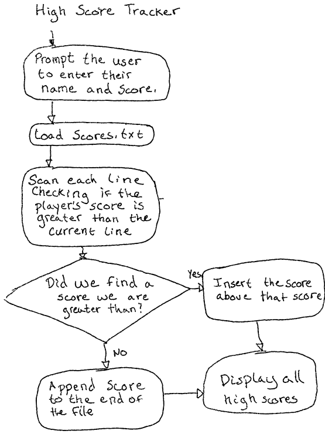
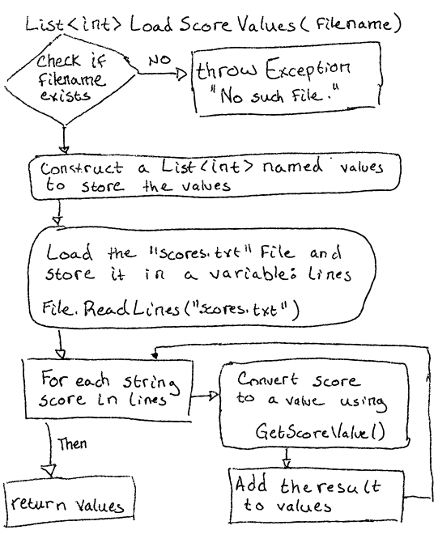
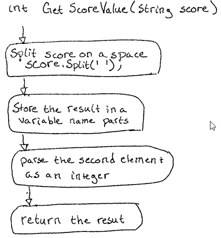
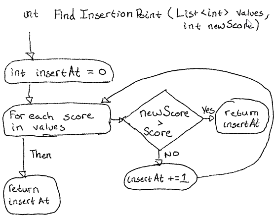
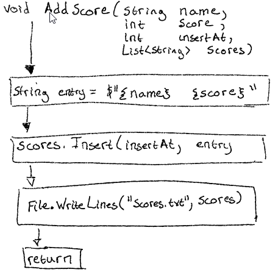

# High Score Tracker

## Description

Keeping track of a players high score is a chore! With the High Score Tracker,
you can digitally keep track of high scores without the tedium of memorization,
a pen, or paper!

## Overview

The purpose of High Score Tracker is to keep a record of high scores for a game.
The player enters their name and score using the keyboard. The player's score is
then added in the correct location in the high score list. Finally, the updated high
score list is output to the console.

## High Level Design

At a high level the High Score Tracker in the following way:

1. Prompts the user to enter their name and score
2. Loads the scores from "scores.txt"
3. Scans each line to find the correct place to put the player's score
4. When it finds a score in the list that is lower than the player's score
   * Inserts the score above that score 
5. If it reaches the end of the list, it means the player has the new lowest score
   * Adds the score to the end of the list
6. Displays the updated high score list

### Flowchart

## Methods

The process for maintaining a High Score list in a text file is a little
complex. To help with this, I've chosen to break it into these 4 helper methods:

* `static List<int> LoadScoreValues(string filename);`
* `static int GetScoreValue(string score);`
* `static int FindInsertionPoint(List<int> values, int newScore);`
* `static void AddScore(String name, int score, int insertAt, List<String> scores);`

### List<int> LoadScoreValues(string filename)

The scores.txt file is stored in two columns. The first column is the players
name and the second column is the players score. This method loads the file and
extracts the second column into a `List<int>`.

1. Check to see if the specified filename exists.
2. If it does not, throw an exception stating the file cannot be loaded
3. Load the file as a List<string> and store it in a variable named, "lines"
4. Create a List<int> called values.
5. Loop through each line
   * For each line, use GetScoreValue to extract the second column as an `int`
   * Add the `int` to `values` 
6. Return `values`

### int GetScoreValue(string score)

This is a helper method which, given a score string of the format "name score",
extracts the score value from the second column, parses it into an int value,
and finally returns it.

1. Split the specified score string into two strings using `' '` as a delimiter
2. Store the result in a variable called `parts`
3. Parse the second element as an int `int.Parse(parts[1])`
4. Return the result

### int FindInsertionPoint(List<int> values, int newScore)

Given a list of score values and a newScore to insert into the high scores
table, returns the index where the new score should be inserted.

1. Initialize a counter variable, insertAt, to 0.
2. Loop through each value in values
   * If the new score is greater than the current value, we should insert above
     that score so we return `insertAt`.
   * Otherwise, the new score should not be inserted above this score so we
     increment `insertAt` by 1 and continue.
3. If we reach the end of the list, `insertAt` should be the length of the list
   so we return `insertAt`.

### void AddScore(string name, int score, int insertAt, List<string> scores);

Given the name, score, insertion location, and a list of strings containing the
current high scores, inserts the name and score at the specified location. Then
writes the results to "scores.txt".

1. Create a string variable `entry` which will be the new row to add to the high
   score list.
2. Assign `entry` to be `$"{name} {score}"`
3. Insert `entry` into `scores` at the index `insertAt`
4. Use `File.WriteLines` to write each line of the `scores` list to the file "scores.txt"
